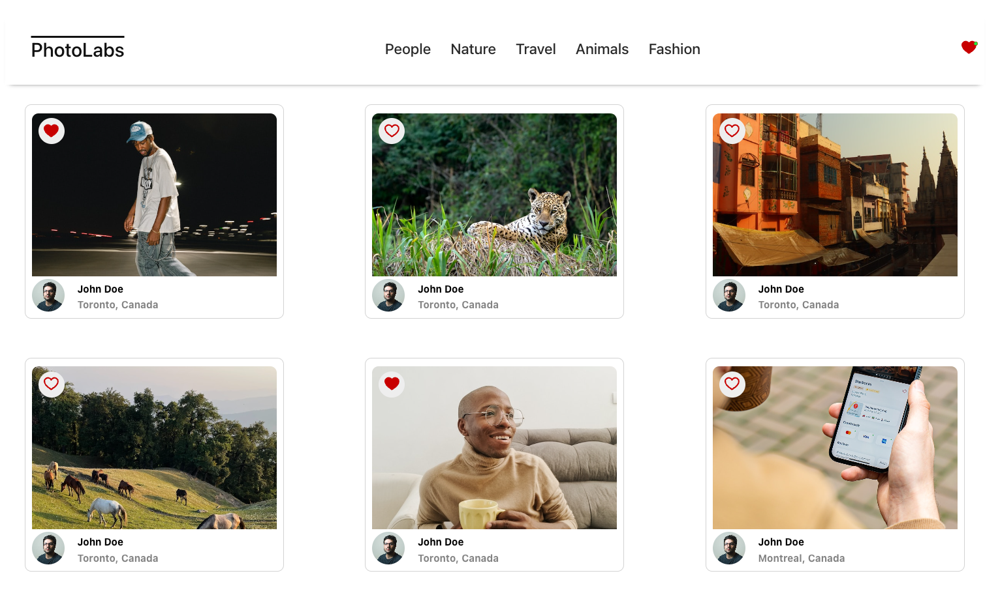
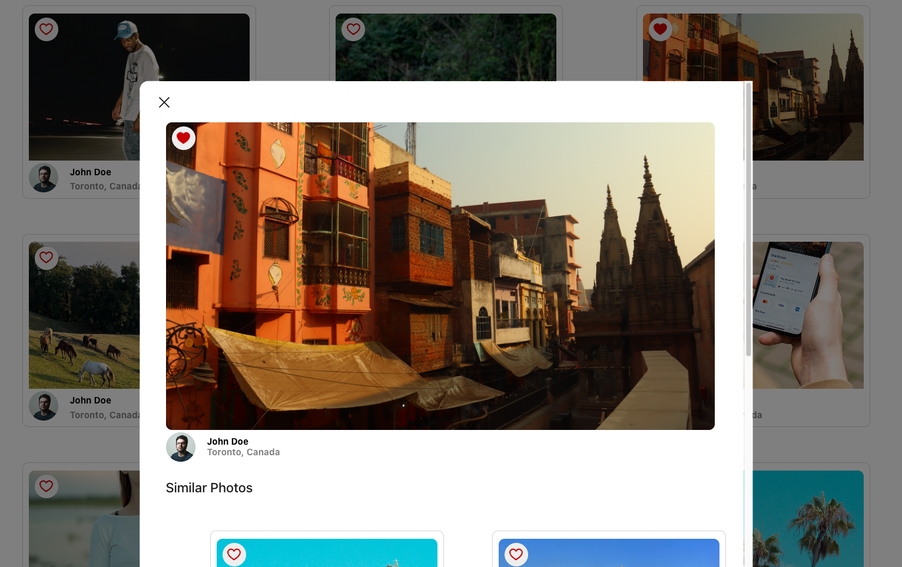

# Photolabs

PhotoLabs is a React-based single page application (SPA) for users to view and favourite submitted photos by topics.

This project was completed as a part of my schooling through Lighthouse Labs (https://www.lighthouselabs.ca).

## Final Product Photos

Home Page View with favourited photos



Modal View when a photo is selected



## App Features

- Users can select any photo which opens a modal view of the full size image with smaller photos in the same topic visible below
- Users can filter their view of the photos by selecting one of the five topics in the top navigation bar
- Users can return to viewing all the photos by selecting the PhotoLabs logo
- Users can favourite photos by selecting the heart icon overlaying the image
- Users are notified that they have favourited new photos by a notification in the heart icon in the top navigation bar

## Setup

Install dependencies with `npm install` in each respective `/frontend` and `/backend`.

## [Frontend] Running Webpack Development Server

```sh
cd frontend
npm start
```

## [Backend] Running Backend Servier

Read `backend/readme` for further setup details.

```sh
cd backend
npm start
```
